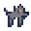
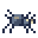
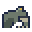
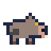
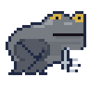

# キャラクターアート対応表

最終更新: 2026-08-24

キャラクター設定とスプライト画像の対応、および制作・承認・ゲーム反映の進行状況を管理する。

## 登録一覧

| 管理ID | ゲーム側ID | キャラクター | 区分 | プレビュー | 原寸画像 | 向き・状態 | アート状態 | ゲーム反映 | 備考 |
|---|---|---|---|---|---|---|---|---|---|
| `CHAR-HERO-001` | `hero` | 冒険者 | プレイヤー |  | [16×16 PNG](../proto/assets/sprites/hero/concepts/b-scout-right-idle.png) | 右・待機1 | 候補選定中 | 未反映 | 候補Bをキープ。選択式キャラ絵を想定し、B・D・E・F・G・Hの6候補を保存。最終採用は未決定 |
| `ALLY-WARRIOR-001` | `warrior` | 剣士 | 仲間 |  | [16×16 PNG](../proto/assets/sprites/allies/swordsman/right-idle-v1.png) | 右・待機1 | 承認済み | 未反映 | 茶髪、両目1px、剣、丸盾、鎖帷子 |
| `ALLY-KNIGHT-001` | `knight` | 重騎士 | 仲間 |  | [16×16 PNG](../proto/assets/sprites/allies/heavy-knight/right-idle-v2.png) | 右・待機1 | 承認済み | 未反映 | 全身を鋼色で統一。フルフェイス兜、幅広い板金鎧、大剣 |
| `ALLY-ROGUE-001` | `rogue` | 盗賊 | 仲間 |  | [16×16 PNG](../proto/assets/sprites/allies/rogue/right-idle-v2.png) | 右・待機1 | 承認済み | 未反映 | 黄土色のフードとスカーフ、顔マスク、両手の短剣 |
| `ALLY-PRIEST-001` | `priest` | 僧侶 | 仲間 |  | [16×16 PNG](../proto/assets/sprites/allies/priest/right-idle-v2.png) | 右・待機1 | 承認済み | 未反映 | 白いウィンプル、濃紺のベールと長衣、典礼杖 |
| `ALLY-HUNTER-001` | `hunter` | 狩人 | 仲間 |  | [16×16 PNG](../proto/assets/sprites/allies/hunter/right-idle-v1.png) | 右・待機1 | 承認済み | 未反映 | 緑のフード、右手の弓、背中の矢筒 |
| `ALLY-MAGE-001` | `mage` | 魔術師 | 仲間 |  | [16×16 PNG](../proto/assets/sprites/allies/mage/right-idle-v3-draft.png) | 右・待機1 | v3・要確認 | 未反映 | 大きな紫の三角帽子、影の顔と水色の両目、魔力結晶付きの杖 |
| `ALLY-PALADIN-001` | `paladin` | パラディン（聖騎士） | 上位仲間 |  | [16×16 PNG](../proto/assets/sprites/allies/paladin/right-idle-v4-draft.png) | 右・待機1 | 承認済み | 未反映 | 金髪の女性聖騎士。明るい左目側の顔影、青いタバード、象牙色の鎧、盾、頭高まで届く長剣（ゲーム側の武器設定は現時点でメイス） |
| `ALLY-SUMMONER-001` | `summoner` | 召喚士 | 上位仲間 |  | [16×16 PNG](../proto/assets/sprites/allies/summoner/right-idle-v1.png) | 右・待機1 | 承認済み | 未反映 | 青緑の重ねフードとローブ、護符付きの杖、左後方の使い魔 |
| `ALLY-ARCHMAGE-001` | `archmage` | 大魔導士 | 上位仲間 |  | [16×16 PNG](../proto/assets/sprites/allies/archmage/right-idle-v2.png) | 右・待機1 | 承認済み | 未反映 | 腰を深く曲げた老魔術師。白眉・白髪・長い白髭、魔力球付きの杖 |
| `ENEMY-BEAST-RUSH-001` | `beast / rush` | アッシュハウンド | 敵 |  | [16×16 PNG](../proto/assets/sprites/enemies/ash-hound/right-idle-v3-draft.png) | 右・待機1 | v3・要確認 | 未反映 | 序盤の突進型。v2の全シルエットを維持し、琥珀眼の左下へ2pxの青紫影を追加 |
| `ENEMY-BEAST-RANGE-001` | `beast / range` | ダストスパイダー | 敵 |  | [16×16 PNG](../proto/assets/sprites/enemies/dust-spider/right-idle-v2-draft.png) | 右・待機1 | v2・要確認 | 未反映 | 間合いを保つ遠距離型。胴を低くし、2〜3pxの短い8脚相当と黄白の眼・射出口を維持 |
| `ENEMY-BEAST-TURRET-001` | `beast / turret` | アッシュトード | 敵 |  | [16×16 PNG](../proto/assets/sprites/enemies/ash-toad/right-idle-v2-draft.png) | 右・待機1 | v2・要確認 | 未反映 | 動かない高耐久砲台型。灰緑の低い体、眼丘、長い水平口、円い折れ後脚、小さな前脚と趾で蛙形を明示 |
| `ENEMY-BEAST-SWARM-001` | `beast / swarm` | ストーンボア | 敵 |  | [16×16 PNG](../proto/assets/sprites/enemies/stone-boar/right-idle-v2-draft.png) | 右・待機1 | v2・要確認 | 未反映 | 高速・低耐久の群れ型。短い尾、三角耳、箱型の豚鼻・鼻孔、短い牙と蹄で猪形を明示 |
| `BOSS-MID-ASH-FROG-001` | `uniqueBoss:5` | 灰の大蛙 | 中ボス |  | [32×32 PNG](../proto/assets/sprites/enemies/great-ash-frog/right-idle-v2-draft.png) | 右・待機1 | v2・要確認 | 未反映 | 第5階層の現象体。ネイティブ32px。大きな眼丘、上寄りの水平口、Z字に畳んだ巨大後脚、独立した小前脚と3趾 |

## 冒険者デザイン候補

選択式キャラクターアートを想定した右向き・待機1の候補。Bはキープ指定、D〜Hは追加提案。

| 候補 | デザイン | プレビュー | 原寸画像 | 状態 | 識別要素 |
|---|---|---|---|---|---|
| B | 遺跡の斥候 |  | [16×16 PNG](../proto/assets/sprites/hero/concepts/b-scout-right-idle.png) | キープ | 赤茶の束ね髪、苔緑の肩マント、ロープ束 |
| D | 蒼衣の地図師 |  | [16×16 PNG](../proto/assets/sprites/hero/concepts/d-cartographer-right-idle-v3.png) | v3・要確認 | 両目を共通座標へ修正し、Hと同じ位置に3pxのあご影を追加。青みの濃い髪、暖色の明るい肌、青ジャケット、生成りシャツ、巻物筒 |
| E | 金髪の回収屋 |  | [16×16 PNG](../proto/assets/sprites/hero/concepts/e-salvager-right-idle-v3.png) | v3・要確認 | 両目を共通座標へ修正し、Hと同じ位置に3pxのあご影を追加。金髪ボブ、朱色スカーフ、深緑ベスト、小型背嚢 |
| F | 赤髪の坑道歩き |  | [16×16 PNG](../proto/assets/sprites/hero/concepts/f-minewalker-right-idle.png) | 新規・要確認 | 短い赤髪、灰色ベスト、濃青シャツ、携行品なし |
| G | 黒髪の薬草採り |  | [16×16 PNG](../proto/assets/sprites/hero/concepts/g-herbalist-right-idle.png) | 新規・要確認 | 黒髪ポニー、象牙ケープ、青緑服、薬草ポーチ |
| H | 褐色肌の放浪者 |  | [16×16 PNG](../proto/assets/sprites/hero/concepts/h-wanderer-right-idle-v2.png) | v2・要確認 | 右目右上の輪郭を補完し、両足を1px左へ修正。短い縮れ髪、褐色肌、黄土スカーフ、えんじコート、寝具 |

## 方向・アニメーション進行表

| キャラクター | 右・待機1 | 右・待機2 | 左 | 上 | 下 | 移動 | 攻撃 |
|---|---|---|---|---|---|---|---|
| 冒険者 | 候補選定中 | 未着手 | 未着手 | 未着手 | 未着手 | 未着手 | 未着手 |
| 剣士 | 承認済み | 未着手 | 未着手 | 未着手 | 未着手 | 未着手 | 未着手 |
| 重騎士 | 承認済み | 未着手 | 未着手 | 未着手 | 未着手 | 未着手 | 未着手 |
| 盗賊 | 承認済み | 未着手 | 未着手 | 未着手 | 未着手 | 未着手 | 未着手 |
| 僧侶 | 承認済み | 未着手 | 未着手 | 未着手 | 未着手 | 未着手 | 未着手 |
| 狩人 | 承認済み | 未着手 | 未着手 | 未着手 | 未着手 | 未着手 | 未着手 |
| 魔術師 | 要確認 | 未着手 | 未着手 | 未着手 | 未着手 | 未着手 | 未着手 |
| パラディン（聖騎士） | 承認済み | 未着手 | 未着手 | 未着手 | 未着手 | 未着手 | 未着手 |
| 召喚士 | 承認済み | 未着手 | 未着手 | 未着手 | 未着手 | 未着手 | 未着手 |
| 大魔導士 | 承認済み | 未着手 | 未着手 | 未着手 | 未着手 | 未着手 | 未着手 |
| アッシュハウンド | 要確認 | 未着手 | 未着手 | 未着手 | 未着手 | 未着手 | 未着手 |
| ダストスパイダー | 要確認 | 未着手 | 未着手 | 未着手 | 未着手 | 未着手 | 未着手 |
| アッシュトード | 要確認 | 未着手 | 未着手 | 未着手 | 未着手 | 未着手 | 未着手 |
| ストーンボア | 要確認 | 未着手 | 未着手 | 未着手 | 未着手 | 未着手 | 未着手 |
| 灰の大蛙 | 要確認 | 未着手 | 未着手 | 未着手 | 未着手 | 未着手 | 未着手 |

## 共通制作ルール

1. 通常キャラクターの原寸スプライトは透明背景の `16×16px` RGBA PNGとする。中ボスは大きさの識別が必要な場合に限り、ネイティブ `32×32px` を使用してよい。
2. 16pxスプライトの標準領域は中央の `12×12px`。上下に2pxずつ透明余白を設ける。32px中ボスも外周に1px以上の透明余白を残す。
3. 元のシルエットが横13pxでも、16×16に収まる場合は潰さず使用してよい。32px中ボスは透明外周を残した範囲で最大28〜29px程度まで使用してよい。
4. 1ドットは原寸画像の1pxとして打つ。中間色の補間やアンチエイリアスは使用しない。
5. 確認用画像は原寸をニアレストネイバーで正確に4倍化する。16px原寸は `64×64px`、32px原寸は `128×128px` とする。
6. 右向きを基準絵として確定後、左・上・下と待機2コマ目を制作する。
7. 承認済み画像は上書きせず、修正時は `v2`、`v3` のように版を増やす。

## ステータス

| 状態 | 意味 |
|---|---|
| 初稿 | 最初のデザイン案 |
| 要確認 | 画像はあるが、見た目の承認前 |
| 基準 | 他キャラクターの頭身・配色・密度の基準に使用 |
| 候補選定中 | 複数のキャラクターアート候補を保持し、最終採用または選択式採用を検討中 |
| 承認済み | 見た目が確定し、方向・アニメ展開へ進める |
| ゲーム反映済み | 実際の描画処理から参照されている |

## 更新履歴

- 2026-08-24: 一覧を作成。冒険者、剣士、アッシュハウンドを登録。
- 2026-08-24: 盗賊、僧侶、狩人の右向き・待機1の初稿を登録。
- 2026-08-24: 狩人v1を承認済みに更新。盗賊と僧侶をv2へ改訂。
- 2026-08-24: 盗賊v2と僧侶v2を承認済みに更新。重騎士と魔術師の右向き・待機1の初稿を登録。
- 2026-08-24: 重騎士と魔術師をv2へ改訂。
- 2026-08-24: 重騎士v2を承認済みに更新。魔術師を水色の両目を持つv3へ改訂。パラディン、召喚士、大魔導士の右向き・待機1の初稿を登録。
- 2026-08-24: 召喚士v1を承認済みに更新。パラディンと大魔導士をv2へ改訂。
- 2026-08-24: 大魔導士v2を承認済みに更新。パラディンをv3へ改訂。
- 2026-08-24: パラディンをv4へ改訂。左目側の顔影を明るくし、武器を頭高まで届く長剣へ変更（ゲーム側設定は未変更）。
- 2026-08-24: パラディンv4の右向き・待機1を承認済みに更新。
- 2026-08-24: 冒険者をv2へ再制作。意匠を維持しながら12色へ整理し、仲間キャラ共通の濃紺アウトラインと陰影密度へ統一。
- 2026-08-24: 冒険者v2を現行候補から外し、候補Bをキープ。選択式キャラ絵の検討用としてD〜Hの5候補を追加。
- 2026-08-24: 冒険者候補D・Eの目を共通座標へ修正し、Dの髪と肌の色差を強化。候補Hは右目右上の輪郭を補完し、両足を1px左へ移動したv2を追加。
- 2026-08-24: 冒険者候補D・Eの下顔面に、候補Hと同じ座標の3pxあご影を追加したv3を作成。目・外周・装備はv2から変更なし。
- 2026-08-24: 石の坑道に登場するアッシュ系の通常敵3体（ダストスパイダー、アッシュトード、ストーンボア）と、第5階層の中ボス「灰の大蛙」の右向き・待機1初稿を追加。
- 2026-08-24: アッシュハウンドは透明マスクと全座標を維持し、赤褐色から石灰色・青紫影・琥珀眼へ変更したv2を追加。
- 2026-08-24: 敵5体をフィードバックに合わせて改訂。アッシュハウンドv3、短脚化したダストスパイダーv2、蛙形を再設計したアッシュトードv2、猪形を強化したストーンボアv2、ネイティブ32×32の灰の大蛙v2を追加。
