# キャラクターアート対応表

最終更新: 2026-09-04

キャラクター設定とスプライト画像の対応、および制作・承認・ゲーム反映の進行状況を管理する。

## 登録一覧

| 管理ID | ゲーム側ID | キャラクター | 区分 | プレビュー | 原寸画像 | 向き・状態 | アート状態 | ゲーム反映 | 備考 |
|---|---|---|---|---|---|---|---|---|---|
| `CHAR-HERO-001` | `hero_scout` | 冒険者（斥候） | プレイヤー | 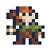 | [64×64 PNG](../proto/assets/sprites/characters/hero/scout-right-idle.png) | 右・待機1 | 承認済み | ゲーム反映済み | 旧候補B。赤茶の束ね髪、苔緑の肩マント、ロープ束。新規ゲーム開始時にランダム選出される6候補の1つ |
| `CHAR-HERO-002` | `hero_cartographer` | 冒険者（地図師） | プレイヤー | 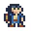 | [64×64 PNG](../proto/assets/sprites/characters/hero/cartographer-right-idle.png) | 右・待機1 | 承認済み | ゲーム反映済み | 旧候補D（v3）。青みの濃い髪、青ジャケット、生成りシャツ、巻物筒。新規ゲーム開始時にランダム選出される6候補の1つ |
| `CHAR-HERO-003` | `hero_salvager` | 冒険者（回収屋） | プレイヤー | 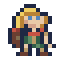 | [64×64 PNG](../proto/assets/sprites/characters/hero/salvager-right-idle.png) | 右・待機1 | 承認済み | ゲーム反映済み | 旧候補E（v3）。金髪ボブ、朱色スカーフ、深緑ベスト、小型背嚢。新規ゲーム開始時にランダム選出される6候補の1つ |
| `CHAR-HERO-004` | `hero_minewalker` | 冒険者（坑道歩き） | プレイヤー | 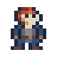 | [64×64 PNG](../proto/assets/sprites/characters/hero/minewalker-right-idle.png) | 右・待機1 | 承認済み | ゲーム反映済み | 旧候補F。短い赤髪、灰色ベスト、濃青シャツ。新規ゲーム開始時にランダム選出される6候補の1つ |
| `CHAR-HERO-005` | `hero_herbalist` | 冒険者（薬草採り） | プレイヤー | 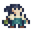 | [64×64 PNG](../proto/assets/sprites/characters/hero/herbalist-right-idle.png) | 右・待機1 | 承認済み | ゲーム反映済み | 旧候補G。黒髪ポニー、象牙ケープ、青緑服、薬草ポーチ。新規ゲーム開始時にランダム選出される6候補の1つ |
| `CHAR-HERO-006` | `hero_wanderer` | 冒険者（放浪者） | プレイヤー | 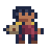 | [64×64 PNG](../proto/assets/sprites/characters/hero/wanderer-right-idle.png) | 右・待機1 | 承認済み | ゲーム反映済み | 旧候補H（v2）。短い縮れ髪、褐色肌、黄土スカーフ、えんじコート。新規ゲーム開始時にランダム選出される6候補の1つ |
| `ALLY-WARRIOR-001` | `warrior` | 剣士 | 仲間 | 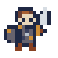 | [64×64 PNG](../proto/assets/sprites/characters/allies/warrior-right-idle.png) | 右・待機1 | 承認済み | ゲーム反映済み | 茶髪、両目1px、剣、丸盾、鎖帷子。2人目・3人目用の色違いあり |
| `ALLY-KNIGHT-001` | `knight` | 重騎士 | 仲間 | 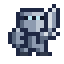 | [64×64 PNG](../proto/assets/sprites/characters/allies/knight-right-idle.png) | 右・待機1 | 承認済み | ゲーム反映済み | 全身を鋼色で統一。フルフェイス兜、幅広い板金鎧、大剣。2人目・3人目用の色違いあり |
| `ALLY-ROGUE-001` | `rogue` | 盗賊 | 仲間 | 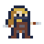 | [64×64 PNG](../proto/assets/sprites/characters/allies/rogue-right-idle.png) | 右・待機1 | 承認済み | ゲーム反映済み | 黄土色のフードとスカーフ、顔マスク、両手の短剣。2人目・3人目用の色違いあり |
| `ALLY-PRIEST-001` | `priest` | 僧侶 | 仲間 | 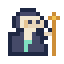 | [64×64 PNG](../proto/assets/sprites/characters/allies/priest-right-idle.png) | 右・待機1 | 承認済み | ゲーム反映済み | 白いウィンプル、濃紺のベールと長衣、典礼杖。2人目・3人目用の色違いあり |
| `ALLY-HUNTER-001` | `hunter` | 狩人 | 仲間 | 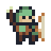 | [64×64 PNG](../proto/assets/sprites/characters/allies/hunter-right-idle.png) | 右・待機1 | 承認済み | ゲーム反映済み | 緑のフード、右手の弓、背中の矢筒。2人目・3人目用の色違いあり |
| `ALLY-MAGE-001` | `mage` | 魔術師 | 仲間 | 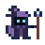 | [64×64 PNG](../proto/assets/sprites/characters/allies/mage-right-idle.png) | 右・待機1 | 承認済み | ゲーム反映済み | 大きな紫の三角帽子、影の顔と水色の両目、魔力結晶付きの杖。2人目・3人目用の色違いあり |
| `ALLY-PALADIN-001` | `paladin` | パラディン（聖騎士） | 上位仲間 |  | [16×16 PNG](../proto/assets/sprites/allies/paladin/right-idle-v4-draft.png) | 右・待機1 | 承認済み | 未反映 | 金髪の女性聖騎士。明るい左目側の顔影、青いタバード、象牙色の鎧、盾、頭高まで届く長剣（ゲーム側の武器設定は現時点でメイス） |
| `ALLY-SUMMONER-001` | `summoner` | 召喚士 | 上位仲間 |  | [16×16 PNG](../proto/assets/sprites/allies/summoner/right-idle-v1.png) | 右・待機1 | 承認済み | 未反映 | 青緑の重ねフードとローブ、護符付きの杖、左後方の使い魔 |
| `ALLY-ARCHMAGE-001` | `archmage` | 大魔導士 | 上位仲間 |  | [16×16 PNG](../proto/assets/sprites/allies/archmage/right-idle-v2.png) | 右・待機1 | 承認済み | 未反映 | 腰を深く曲げた老魔術師。白眉・白髪・長い白髭、魔力球付きの杖 |
| `ENEMY-BEAST-RUSH-001` | `beast / rush` | アッシュハウンド | 敵 | 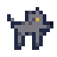 | [16×16 PNG](../proto/assets/sprites/enemies/ash-hound/right-idle-v5.png) | 右・待機1 | 承認済み | 未反映 | 別タスクでユーザーがレタッチし、最新版に指定した64×64画像を採用。透明画素を正規化して16×16へ復元し、可視画素は元画像と完全一致 |
| `ENEMY-BEAST-RANGE-001` | `beast / range` | ダストスパイダー | 敵 |  | [16×16 PNG](../proto/assets/sprites/enemies/dust-spider/right-idle-v2-draft.png) | 右・待機1 | 承認済み | 未反映 | 胴を低くし、2〜3pxの短い8脚相当と黄白の眼・射出口を維持 |
| `ENEMY-BEAST-TURRET-001` | `beast / turret` | アッシュトード | 敵 | 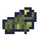 | [16×16 PNG](../proto/assets/sprites/enemies/ash-toad/right-idle-v3-draft.png) | 右・待機1 | 承認済み | 未反映 | 苔灰色の低い体、大きな金眼、水平口、丸い折れ後脚を優先し、カエルの横姿としてゼロベース再設計 |
| `ENEMY-BEAST-SWARM-001` | `beast / swarm` | ストーンボア | 敵 | 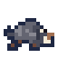 | [16×16 PNG](../proto/assets/sprites/enemies/stone-boar/right-idle-v3-draft.png) | 右・待機1 | 承認済み | 未反映 | 選択された参考案を基準に、高い灰色の肩、茶色い耳・短脚、淡い眼、箱型の鼻と大きな上向き牙を整理 |
| `ENEMY-MOSS-BALL-001` | `moss-ball` | 苔玉 | 敵 | 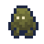 | [16×16 PNG](../proto/assets/sprites/enemies/moss-ball/front-idle-v1.png) | 正面・待機1 | 承認済み | ゲーム反映済み | ユーザー指定の最新v6を採用。段状の頭、1pxの両目、短い腕、左右非対称の足、必要箇所のみの濃紺アウトライン |
| `BOSS-MID-ASH-FROG-001` | `uniqueBoss:5` | 灰の大蛙 | 中ボス | 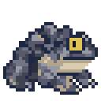 | [32×32 PNG](../proto/assets/sprites/enemies/great-ash-frog/right-idle-v4-draft.png) | 右・待機1 | v4・要確認 | 未反映 | v3の外形・配色・陰影を完全維持し、添付画像に合わせて黒目を2×2pxから縦1×2pxへ修正 |

## 初期解放ジョブの色違い

同じ初期解放ジョブをパーティへ複数加入させた場合、パーティ内で同職が何人目かに応じて通常色・`_2`・`_3`を自動で使い分ける。酒場など、まだパーティに加入していない候補は通常色で表示する。

| ジョブ | 1人目 | 2人目 | 3人目 |
|---|---|---|---|
| 剣士 |  | 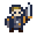 | 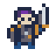 |
| 重騎士 |  | 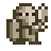 | 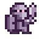 |
| 盗賊 |  | 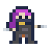 | 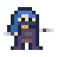 |
| 僧侶 |  | 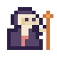 | 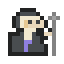 |
| 狩人 |  | 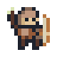 | 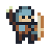 |
| 魔術師 |  | 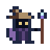 | 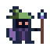 |

## 冒険者デザイン候補（採用済み）

以前は選択式キャラクターアートの候補案だったが、**6候補すべてを採用**し、
新規ゲーム開始のたびにランダムに1体が選ばれる仕様で反映済み（`CHAR-HERO-001`〜`006`、
実データは `proto/assets/sprites/characters/hero/` の各 `*-right-idle.png`、
`index.html` の `CharacterArt.FILES` に `hero_scout` などのキーで埋め込み済み）。
下表は元の候補一覧（デザイン意図の記録として残す）。

| 候補 | デザイン | プレビュー | 原寸画像 | 状態 | 識別要素 |
|---|---|---|---|---|---|
| B | 遺跡の斥候（`hero_scout`） |  | [16×16 PNG](../proto/assets/sprites/hero/concepts/b-scout-right-idle.png) | 採用済み | 赤茶の束ね髪、苔緑の肩マント、ロープ束 |
| D | 蒼衣の地図師（`hero_cartographer`） |  | [16×16 PNG](../proto/assets/sprites/hero/concepts/d-cartographer-right-idle-v3.png) | 採用済み（v3） | 両目を共通座標へ修正し、Hと同じ位置に3pxのあご影を追加。青みの濃い髪、暖色の明るい肌、青ジャケット、生成りシャツ、巻物筒 |
| E | 金髪の回収屋（`hero_salvager`） |  | [16×16 PNG](../proto/assets/sprites/hero/concepts/e-salvager-right-idle-v3.png) | 採用済み（v3） | 両目を共通座標へ修正し、Hと同じ位置に3pxのあご影を追加。金髪ボブ、朱色スカーフ、深緑ベスト、小型背嚢 |
| F | 赤髪の坑道歩き（`hero_minewalker`） |  | [16×16 PNG](../proto/assets/sprites/hero/concepts/f-minewalker-right-idle.png) | 採用済み | 短い赤髪、灰色ベスト、濃青シャツ、携行品なし |
| G | 黒髪の薬草採り（`hero_herbalist`） |  | [16×16 PNG](../proto/assets/sprites/hero/concepts/g-herbalist-right-idle.png) | 採用済み | 黒髪ポニー、象牙ケープ、青緑服、薬草ポーチ |
| H | 褐色肌の放浪者（`hero_wanderer`） |  | [16×16 PNG](../proto/assets/sprites/hero/concepts/h-wanderer-right-idle-v2.png) | 採用済み（v2） | 右目右上の輪郭を補完し、両足を1px左へ修正。短い縮れ髪、褐色肌、黄土スカーフ、えんじコート、寝具 |

## 方向・アニメーション進行表

| キャラクター | 右・待機1 | 右・待機2 | 左 | 上 | 下 | 移動 | 攻撃 |
|---|---|---|---|---|---|---|---|
| 冒険者 | 候補選定中 | 未着手 | 未着手 | 未着手 | 未着手 | 未着手 | 未着手 |
| 剣士 | 承認済み | 未着手 | 未着手 | 未着手 | 未着手 | 未着手 | 未着手 |
| 重騎士 | 承認済み | 未着手 | 未着手 | 未着手 | 未着手 | 未着手 | 未着手 |
| 盗賊 | 承認済み | 未着手 | 未着手 | 未着手 | 未着手 | 未着手 | 未着手 |
| 僧侶 | 承認済み | 未着手 | 未着手 | 未着手 | 未着手 | 未着手 | 未着手 |
| 狩人 | 承認済み | 未着手 | 未着手 | 未着手 | 未着手 | 未着手 | 未着手 |
| 魔術師 | 要確認 | 未着手 | 未着手 | 未着手 | 未着手 | 未着手 | 未着手 |
| パラディン（聖騎士） | 承認済み | 未着手 | 未着手 | 未着手 | 未着手 | 未着手 | 未着手 |
| 召喚士 | 承認済み | 未着手 | 未着手 | 未着手 | 未着手 | 未着手 | 未着手 |
| 大魔導士 | 承認済み | 未着手 | 未着手 | 未着手 | 未着手 | 未着手 | 未着手 |
| アッシュハウンド | 承認済み | 未着手 | 未着手 | 未着手 | 未着手 | 未着手 | 未着手 |
| ダストスパイダー | 承認済み | 未着手 | 未着手 | 未着手 | 未着手 | 未着手 | 未着手 |
| アッシュトード | 承認済み | 未着手 | 未着手 | 未着手 | 未着手 | 未着手 | 未着手 |
| ストーンボア | 承認済み | 未着手 | 未着手 | 未着手 | 未着手 | 未着手 | 未着手 |
| 苔玉 | 承認済み（正面） | 未着手 | 不要 | 未着手 | 未着手 | 未着手 | 未着手 |
| 灰の大蛙 | 要確認 | 未着手 | 未着手 | 未着手 | 未着手 | 未着手 | 未着手 |

## 共通制作ルール

1. 通常キャラクターの原寸スプライトは透明背景の `16×16px` RGBA PNGとする。中ボスは大きさの識別が必要な場合に限り、ネイティブ `32×32px` を使用してよい。
2. 16pxスプライトの標準領域は中央の `12×12px`。上下に2pxずつ透明余白を設ける。32px中ボスも外周に1px以上の透明余白を残す。
3. 元のシルエットが横13pxでも、16×16に収まる場合は潰さず使用してよい。32px中ボスは透明外周を残した範囲で最大28〜29px程度まで使用してよい。
4. 1ドットは原寸画像の1pxとして打つ。中間色の補間やアンチエイリアスは使用しない。
5. 通常キャラクターの目は片目につき原寸1pxで表現する。目の大きさ自体が識別要素となる例外は、個別に承認された場合のみ使用する。
6. 確認用画像は原寸をニアレストネイバーで正確に4倍化する。16px原寸は `64×64px`、32px原寸は `128×128px` とする。
7. 右向きを基準絵として確定後、左・上・下と待機2コマ目を制作する。
8. 承認済み画像は上書きせず、修正時は `v2`、`v3` のように版を増やす。

## ステータス

| 状態 | 意味 |
|---|---|
| 初稿 | 最初のデザイン案 |
| 要確認 | 画像はあるが、見た目の承認前 |
| 基準 | 他キャラクターの頭身・配色・密度の基準に使用 |
| 候補選定中 | 複数のキャラクターアート候補を保持し、最終採用または選択式採用を検討中 |
| 承認済み | 見た目が確定し、方向・アニメ展開へ進める |
| ゲーム反映済み | 実際の描画処理から参照されている |

## 更新履歴

- 2026-08-24: 一覧を作成。冒険者、剣士、アッシュハウンドを登録。
- 2026-08-24: 盗賊、僧侶、狩人の右向き・待機1の初稿を登録。
- 2026-08-24: 狩人v1を承認済みに更新。盗賊と僧侶をv2へ改訂。
- 2026-08-24: 盗賊v2と僧侶v2を承認済みに更新。重騎士と魔術師の右向き・待機1の初稿を登録。
- 2026-08-24: 重騎士と魔術師をv2へ改訂。
- 2026-08-24: 重騎士v2を承認済みに更新。魔術師を水色の両目を持つv3へ改訂。パラディン、召喚士、大魔導士の右向き・待機1の初稿を登録。
- 2026-08-24: 召喚士v1を承認済みに更新。パラディンと大魔導士をv2へ改訂。
- 2026-08-24: 大魔導士v2を承認済みに更新。パラディンをv3へ改訂。
- 2026-08-24: パラディンをv4へ改訂。左目側の顔影を明るくし、武器を頭高まで届く長剣へ変更（ゲーム側設定は未変更）。
- 2026-08-24: パラディンv4の右向き・待機1を承認済みに更新。
- 2026-08-24: 冒険者をv2へ再制作。意匠を維持しながら12色へ整理し、仲間キャラ共通の濃紺アウトラインと陰影密度へ統一。
- 2026-08-24: 冒険者v2を現行候補から外し、候補Bをキープ。選択式キャラ絵の検討用としてD〜Hの5候補を追加。
- 2026-08-24: 冒険者候補D・Eの目を共通座標へ修正し、Dの髪と肌の色差を強化。候補Hは右目右上の輪郭を補完し、両足を1px左へ移動したv2を追加。
- 2026-08-24: 冒険者候補D・Eの下顔面に、候補Hと同じ座標の3pxあご影を追加したv3を作成。目・外周・装備はv2から変更なし。
- 2026-08-24: 石の坑道に登場するアッシュ系の通常敵3体（ダストスパイダー、アッシュトード、ストーンボア）と、第5階層の中ボス「灰の大蛙」の右向き・待機1初稿を追加。
- 2026-08-24: アッシュハウンドは透明マスクと全座標を維持し、赤褐色から石灰色・青紫影・琥珀眼へ変更したv2を追加。
- 2026-08-24: 敵5体をフィードバックに合わせて改訂。アッシュハウンドv3、短脚化したダストスパイダーv2、蛙形を再設計したアッシュトードv2、猪形を強化したストーンボアv2、ネイティブ32×32の灰の大蛙v2を追加。
- 2026-08-24: ダストスパイダーv2を承認済みに更新。アッシュハウンドを4段階陰影のv4へ改訂。アッシュトードをゼロベースのv3へ再設計。ユーザー選択の参考案を基準にストーンボアv3と灰の大蛙v3を原寸へ再構成。
- 2026-08-24: アッシュトードv3とストーンボアv3を承認済みに更新。アッシュハウンドは別タスクでユーザーがレタッチした最新版をv5として採用・承認。灰の大蛙は添付画像の縦1×2px黒目だけを移植したv4へ改訂。
- 2026-08-27: 敵キャラクター「苔玉」を登録。ユーザー指定の最新v6を、正面・待機1の承認済み画像として採用し、ダストモスとドゥラントリーに反映。
- 2026-08-27: 初期解放ジョブ6種（剣士・重騎士・盗賊・僧侶・狩人・魔術師）の2人目・3人目用色違いを登録。ゲームでは同職のパーティ内順に通常色・`_2`・`_3`を自動適用する。
